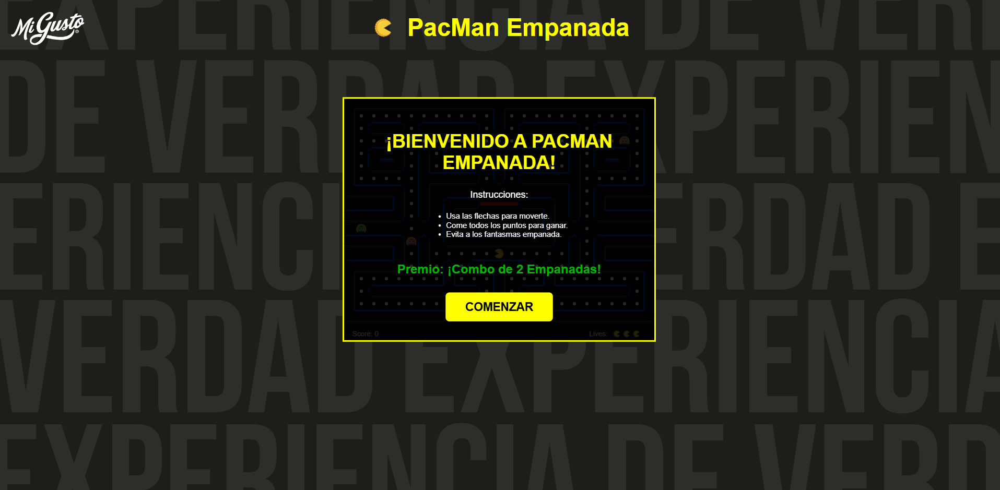
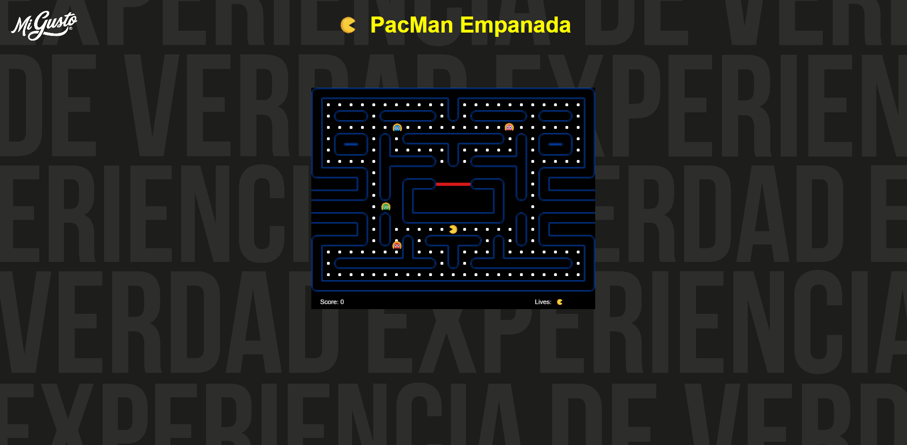

  

  # 🥟 PacMan Empanada

  **Una experiencia arcade clásica reinventada al estilo Mi Gusto.**

  
  
  
  

  ---

## 🌟 Sobre el Proyecto

**PacMan Empanada** es una versión temática e interactiva del legendario videojuego Pac-Man, desarrollada como una experiencia promocional única para **Mi Gusto**. 

El jugador controla a **PacMan Empanada** a través de un laberinto retro repleto de deliciosos puntos por recolectar, mientras esquiva a los traviesos fantasmas empanada. ¡Completar el laberinto desbloquea el ansiado premio: un **Combo de 2 Empanadas**!

---

## ✨ Características Principales

- 🎮 **Nostalgia Arcade**: Mecánicas clásicas de movimiento en grilla con giros suaves y colisiones precisas.
- 🎨 **Diseño Visual Exclusivo**: Sprites e interfaz personalizados integrando la identidad visual de *Mi Gusto 2025*.
- 👻 **Inteligencia de Fantasmas**: Algoritmo de movimiento adaptativo para perseguir y desafiar al jugador.
- 🏆 **Sistema de Recompensas**: Pantallas interactivas de Victoria y Derrota con premios especiales.
- ⚡ **Optimización Fluent & Fast**: Renderizado fluido en HTML5 Canvas impulsado por el motor Phaser 3.

---

## 📸 Galería de Imágenes

  
  &nbsp;
  

  <b>Vista Principal del Laberinto &nbsp;&nbsp;&nbsp;&nbsp;&nbsp;&nbsp;&nbsp;&nbsp;&nbsp;&nbsp;&nbsp;&nbsp;&nbsp;&nbsp;&nbsp;&nbsp;&nbsp;&nbsp;&nbsp;&nbsp;&nbsp;&nbsp;&nbsp;&nbsp;&nbsp;&nbsp;&nbsp;&nbsp;&nbsp;&nbsp;&nbsp;&nbsp; Gameplay y Coleccionables</b>

---

## 🛠️ Tecnologías Utilizadas

- **Phaser 3.12**: Motor de videojuegos 2D para renderizado HTML5 Canvas y física arcade.
- **HTML5 & Vanilla CSS3**: Estructura semántica, tipografías modernas y diseño responsive con estética oscura.
- **JavaScript (ES6+)**: Lógica de juego, IA de fantasmas y control de estado de UI.

---

  Desarrollado con ❤️ para <b>Mi Gusto 2025</b>

